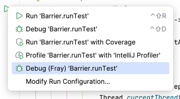
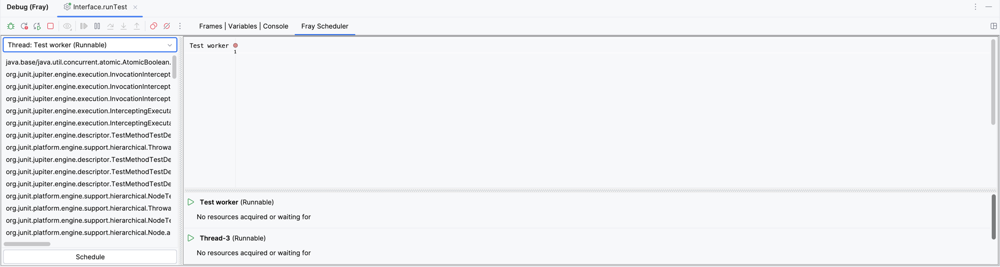
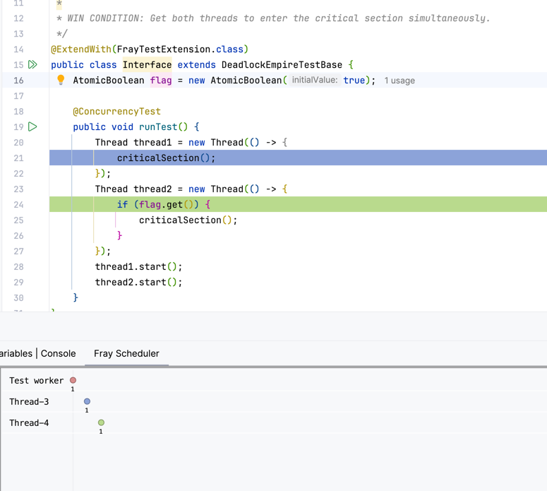

# [Deadlock Empire](https://deadlockempire.github.io/) in Java

To play the game clone the repo and build the project using gradle. 

```shell
git clone https://github.com/aoli-al/deadlock-empire
cd deadlock-empire
./gradlew build
```

Next you may open the project in [IntelliJ IDEA](https://www.jetbrains.com/idea/). To play the game 
you also need to install the [Fray Debugger](https://plugins.jetbrains.com/plugin/26623-fray-debugger) plugin.


## Play the Game!

All games are located in the `src/test/java/org/deadlockempire` directory. 
To play a game, open the file and run the test with Fray Debugger. And then select `frayTest`.



The first time you start the game, it will take some time to set up the environment. Please be patient.

### Control Panel

When the game/test starts, you will see the control panel at the bottom of the screen. It has three
panels, a scheduling panel, a timeline panel, and a resource panel.



#### Scheduling Panel

Scheduling panel shows all executing threads in your program. It shows the stack 
trace of each thread as well. You may also click a stack trace to navigate to the source code.

> [!NOTE]  
> Currently the debugger only opens a file if it is in source directory. It does not open source files
> in JDK or library.

You may also use the drop-down menu to select a thread to view. Once you have decided which 
thread to run. Click the `Schedule` button to run the thread!


#### Timeline Panel

Timeline panel shows the execution timeline of the program. Each time you click `Schedule` button, the timeline 
refreshes and shows the new state of the program. 


#### Resource Panel

When a thread acquires a lock, it will appear in the resource panel, along with the resource it is waiting for if the thread is blocked.


After you click the `Schedule` button, the debugger shows the executing lines of each thread in your editor. 



Along with the updated timeline.


### Game Rules


The goal of the game is to be an evil scheduler! You want to guide the execution of the program so that it crashes. 
